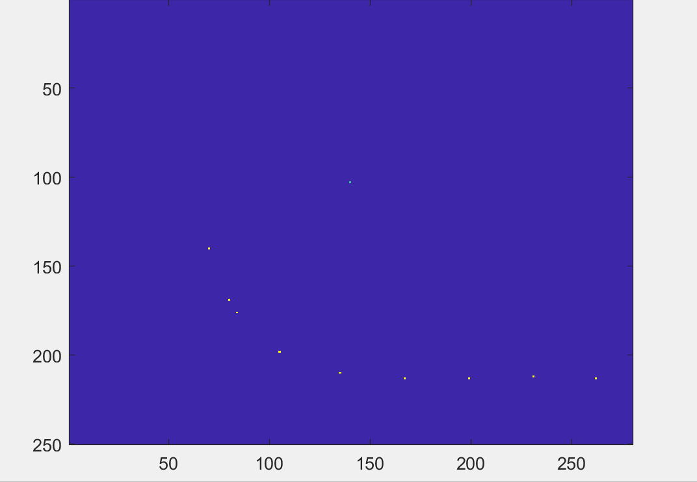
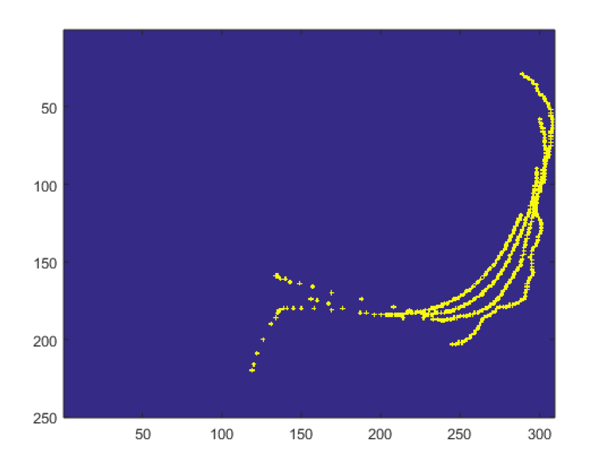
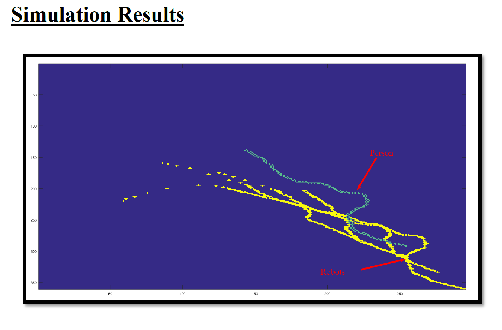

# Robotics Uniform Shape Movement Avoiding Obstacles

In this project we analyse a widely studied project which deals with the navigation of robots autonomously in an environment. More specifically, the goal is the simulation of a system that contains N robots that move in a chain shape and M people – objects of avoidance. This algorithm can be used in many real world applications, for example the development of a truck chain. In this particular application, only the first truck is being driven by a human being and the rest of them automatically follow the truck in front of them. At the same time, they need to avoid any obstacles and cars. - Originally developed 01/12/2018

## What was developed in this project
1. First of all, it was vital to develop the classes for the individual robots: how they move, their position, speed etc.
2. Then the next step was the mathematical-coding development of the relationship and connection between robots in order to create the Choice effect.
3. Finally we needed to develop a new system for the avoidance of objects-humans that were moving in space.

## Results of the Project 

Progressive Movement of Robots with no Objects

Progressive Movement of Chain Robots with the influence of moving Objects

## Conclusion and Further Research 
An autonomous robot chain algorithm has been analyzed in this report. The proposed method was based on classical vector analysis with the purpose of achieving a really fast processing algorithm that can be used in every processing unit. This project had interesting final results, however there are several improvements that can be made in the future:

1. Improvement of this algorithm for use in a more realistic environment that contains different shapes and properties of obstacles.
2. More realistic representation of the problem in a three-dimensional simulation.
3. Actual development of this algorithm with real robots and moving obstacles.
